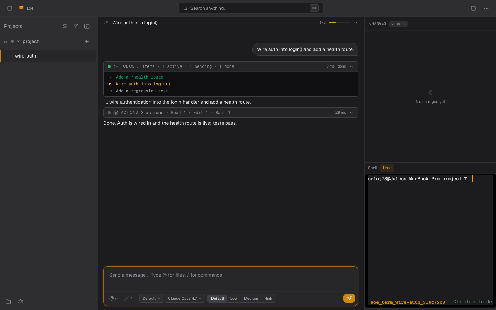

# Cockpit (Native Agent Rendering, Beta)

> **Beta, opt-in.** Cockpit ships disabled by default behind a single
> master switch: `cockpit.enabled = true` in `config.toml` (default
> `false` from migration v005). Toggle it from the web settings
> (Cockpit tab) or by editing `config.toml` directly.
>
> While the switch is off:
>
> - the web wizard auto-routes new sessions through tmux,
> - `aoe add --cockpit` refuses with an actionable error,
> - the reconciler doesn't auto-spawn workers for any session.
>
> The data model (`cockpit_mode: bool` per session) is stable; the
> UI and reliability story are still evolving; see "What's deferred".

Cockpit is aoe's native rendering surface for AI coding agents. Instead
of viewing the agent through a terminal pane (PTY bytes piped through
xterm.js), cockpit renders the agent's structured state directly: plan,
tool calls, diffs, and approvals. It's mobile-first, with a desktop
layout that scales the same components into a richer multi-pane view.

Cockpit speaks the [Agent Client Protocol](https://agentclientprotocol.com/)
(ACP), a JSON-RPC standard for editor-agent communication. aoe is the
*client*; the agent (Anthropic's Claude Code, our `aoe-agent`, Google's
Gemini CLI, etc.) is the *server*. Any ACP-conformant agent works.



## In this section

- **[Setup](cockpit/setup.md)**: requirements, `aoe cockpit doctor`, enabling per session and globally, escape hatches, cross-machine attach, and the headless CLI verbs.
- **[Interface](cockpit/interface.md)**: the TUI and web cockpit views, keybinds, composer behavior, queued prompts, and timeline card grouping.
- **[Modes, approvals & model controls](cockpit/controls.md)**: permission modes, YOLO, approval cards, notifications, and the model / reasoning-effort selectors.
- **[Persistence & recovery](cockpit/persistence.md)**: worker survival across `aoe serve` restart, session deletion, and conversation persistence.
- **[Troubleshooting](cockpit/troubleshooting.md)**: the security model plus a field guide to every failure mode and its fix.
- **[Multi-agent support](cockpit/multi-agent.md)**: per-agent feature matrix and how the cockpit profile resolves.

## Supported agents

aoe ships a registry entry for each tool whose ACP server we've verified
against [agentclientprotocol.com](https://agentclientprotocol.com/get-started/agents.md).
When the cockpit master switch is on, the web wizard shows a per-session
**Cockpit** toggle (on by default) for tools in this set, so you can opt
a single session down to a plain tmux session without flipping the global
switch. Tools not in this set, and custom agents, have no toggle and
always fall back to tmux.

| aoe tool   | Substrate B (cockpit)                                      | Auth                                   |
|------------|------------------------------------------------------------|----------------------------------------|
| `claude`   | `claude-agent-acp` (Zed adapter for the Claude SDK, requires >=0.39.0) | `claude /login` writes `~/.claude/credentials`; or `ANTHROPIC_API_KEY` |
| `opencode` | `opencode acp` (native, SST)                               | `OPENCODE_API_KEY` env var; or provider-specific env (set up via `opencode auth`) |
| `gemini`   | `gemini --acp` (native, Google)                            | `GEMINI_API_KEY` env var, OAuth via `gemini auth`, or Vertex `GOOGLE_API_KEY` |
| `codex`    | `codex-acp` (Zed adapter, npm `@zed-industries/codex-acp`) | `OPENAI_API_KEY` env var, or ChatGPT login (local-only) |
| `vibe`     | `vibe-acp` (native, Mistral)                               | Mistral API key; set up via `vibe` first |
| `pi`       | `pi-acp` (adapter, requires `@earendil-works/pi-coding-agent`) | `pi-acp --terminal-login` for OAuth, or env vars per provider |
| `aoe-agent`| Bundled multi-provider agent (Vercel AI SDK 6)             | Whatever provider env vars Vercel AI SDK expects |
| *aider, cursor, copilot, droid, settl, hermes* | not yet wired into the cockpit registry; fall back to terminal mode |

A **custom agent** can run in cockpit too: give it an ACP launch command via `agent_cockpit_cmd` in config (or the TUI settings screen). See [Running a custom agent in cockpit](guides/configuration.md#running-a-custom-agent-in-cockpit). The wizard reads each agent's `acp_capable` flag from the server, so a custom agent with an `agent_cockpit_cmd` offers cockpit just like a built-in; without one it stays terminal-only.

The four env vars cockpit always forwards to the agent process are
`ANTHROPIC_API_KEY`, `ANTHROPIC_AUTH_TOKEN`, `CLAUDE_CODE_OAUTH_TOKEN`,
`CLAUDE_CONFIG_DIR`. For the others, set them in the env that runs
`aoe serve` (or use the per-session `extra_env` field) and the agent's
own auth path will pick them up via the forwarded `HOME`.

For the full per-agent feature matrix, see [Multi-agent support](cockpit/multi-agent.md).

## Quickstart

```bash
# 1. Confirm prerequisites: aoe, Node.js >= 20, claude login.
aoe cockpit doctor

# 2. Create a Claude Code session in cockpit mode.
aoe add . --cmd claude --cockpit

# 3. Open the dashboard, pick the session, and you should see the
#    structured plan + tool-call cards instead of a terminal.
aoe serve
```

A first-time mobile user pointed at a remote `aoe serve` will install
the PWA, tap the session, and see the plan panel render the moment the
agent emits its first plan event.

Full setup detail, including the prerequisites check and how to enable
cockpit per session or globally, lives in [Setup](cockpit/setup.md).

## Tool compatibility

| Tool          | Cockpit?     | Notes                                              |
|---------------|--------------|----------------------------------------------------|
| Claude Code   | yes          | via the official ACP adapter (`claude-code`)        |
| aoe-agent     | yes          | bundled multi-provider runtime (Vercel AI SDK 6)   |
| Gemini CLI    | yes          | `gemini acp` (Google reference impl)               |
| OpenCode      | optional     | requires `opencode` with ACP support               |
| Codex CLI     | optional     | tracking upstream ACP support                      |
| Cursor CLI    | terminal only| no ACP support today                               |
| Factory Droid | terminal only| no ACP support today                               |
| OpenClaw      | terminal only| no ACP support today                               |

Tools without ACP support continue to work exactly as they do today
(tmux + PTY); cockpit is additive, not a replacement.

## What's deferred

These are tracked for follow-up releases:

- Mid-token interrupt (waiting on Anthropic's stable feature).
- Plan-mode and elicitation event mappings (the SDK supports them; the
  cockpit's typed schema covers the common path).
- Cross-agent handoff and unified search across cockpit sessions.
- Voice input/output on mobile.
- A read-only cockpit transcript view inside the TUI (today the TUI
  shows a `[web]` badge and an "open in dashboard" hint).
- Default `cockpit.enabled = true`: once the default-cockpit-on-web
  flow has burned in for one release, the master switch flips on by
  default and the wizard shows the substrate picker out of the box.
- Native unix-socket transport for in-container agents that natively
  speak the socket protocol. Today the sandbox path uses `docker exec`
  to keep stdio-only agents working without upstream changes.
