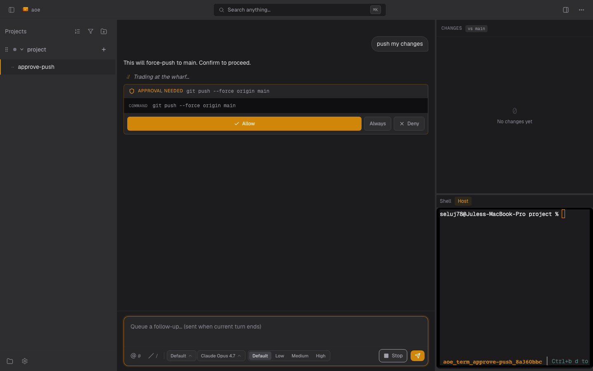

# Modes, Approvals & Model Controls

The composer footer is where you steer a cockpit session: the permission
mode decides what runs without asking, approval cards gate the rest, and
(when the adapter advertises them) model and reasoning-effort selectors
tune the agent itself. For the surrounding UI, see
[Cockpit Interface](interface.md).



## Permission modes and YOLO

Cockpit sessions run in one of the permission modes advertised by the
ACP adapter. The composer's mode picker shows whatever the agent
reports in its `NewSessionResponse.modes`; for `claude-agent-acp` the
typical set is:

| Mode id              | Meaning                                                                 |
|----------------------|-------------------------------------------------------------------------|
| `default`            | Every Write/Edit/Bash routes through an approval card.                  |
| `acceptEdits`        | Edit-kind tools auto-approved; Bash and unknown tools still prompt.     |
| `bypassPermissions`  | All tools auto-approved. The cockpit analogue of YOLO.                  |
| `plan`               | Read-only; the agent drafts a plan but does not run side-effectful tools. |

### YOLO mode maps to `bypassPermissions`

When `[session] yolo_mode_default = true` (or the wizard's "Auto-approve
actions" toggle is on), cockpit asks the adapter to start the session
in `bypassPermissions` immediately after `session/new`. This mirrors
what the tmux substrate does by appending
`--dangerously-skip-permissions` to the Claude CLI argv.

The wiring is best-effort: the cockpit fires `session/set_mode` after
the handshake and continues regardless of the response. If the adapter
accepts, the mode picker flips to `bypassPermissions` and you stop
seeing approval cards. If it rejects (see next section), a non-blocking
amber notice appears above the composer with the adapter's reason and
the session keeps running in whichever mode it landed on.

### `bypassPermissions` may not be available

`claude-agent-acp` gates `bypassPermissions` on the `ALLOW_BYPASS`
environment variable. If the daemon spawned the adapter without
`ALLOW_BYPASS=1` in its env, `session/set_mode("bypassPermissions")`
returns "Mode bypassPermissions is not available" and the session
stays in `default`. Two ways out:

1. Restart `aoe serve` with `ALLOW_BYPASS=1` so the adapter advertises
   the mode. The cockpit then drives it automatically on every new
   YOLO-mode session.
2. Live with `default` and approve as you go, or pick `acceptEdits`
   from the composer mode picker for edit-only auto-approval.

The Auto-approve toggle in the wizard does not configure
`ALLOW_BYPASS`; the env var is a daemon-process input set wherever
`aoe serve` actually launches.

## Approvals

When the agent wants to run a tool that requires approval, the cockpit
shows an approval card:

- **Benign tools** (read, search, list): single tap on a primary
  button.
- **Destructive tools** (`rm -rf`, `git push --force`, writes to
  system paths): long-press 800ms with a progress ring and a haptic
  confirmation. Single tap is reserved for the deny button.

You can configure how cockpit classifies destructive operations and
the timeout before a pending approval auto-cancels:

```toml
[cockpit]
approval_timeout_secs = 300
destructive_require_double_confirm = true
```

### Notifications and sound

When an approval lands, the cockpit fires two channels so a user away
from the dashboard still sees the agent is blocked:

- **Web push.** If the PWA is installed and notifications are
  enabled, the daemon sends an OS-level push tagged
  `cockpit-approval-<session>`. Tapping the notification deep-links
  back to the cockpit. Unlike status-change pushes, approval pushes
  are not suppressed when the dashboard or TUI is active; the service
  worker routes focused clients to an in-app toast instead of an OS
  banner. See [Push notifications](../push-notifications.md).
- **Browser sound.** The cockpit plays a chime in the dashboard tab
  whenever pending approvals go from zero to non-zero. Configure the
  file via `[sound] on_approval` in the daemon config or the Sound
  category of the Settings TUI. The chime is independent of the
  host-side audio used by the tmux status flow; the cockpit case
  often runs `aoe serve` on a remote box and the host speaker would
  be on the wrong side of the wire.

## Model and reasoning effort

Cockpit sessions render two extra selectors in the composer footer
beside the mode pill when the ACP adapter advertises them: a model
dropdown and a reasoning-effort selector. Both come from one wire
mechanism, ACP `SessionUpdate::ConfigOptionUpdate`, stabilised
upstream in `claude-agent-acp` v0.37.0 (Opus 4.8 added in v0.38.0).
The adapter emits the full
snapshot of every selector (mode, model, reasoning effort, future
categories) whenever any one of them changes; the cockpit replaces
its cached list in full.

### When the pickers appear

The pickers only render if the adapter publishes the matching
category. `claude-agent-acp` v0.39.0+ advertises a model selector
for every session, and adds a reasoning-effort selector when the
current model reports `supportsEffort=true`. Older adapters that
emit no `config_option_update` show neither picker; this is by
design so non-Claude backends don't grow empty UI chrome.

### Setting a value

Clicking an option fires `POST /api/sessions/{id}/cockpit/config-option`
with `{ config_id, value }` which the cockpit supervisor turns into
ACP `session/set_config_option`. The UI is pessimistic: the chip
still shows the previous current value while the request is in
flight, with a subtle dim and a disabled re-click on the just-clicked
option, until the adapter pushes a confirming `config_option_update`.
This avoids "snap back" on slow networks (Cloudflare Tunnel can run
300-800ms round trips).

### The `Default` reasoning effort

The reasoning-effort dropdown includes a `Default` option alongside
adapter-supported levels like `Low | Medium | High`. `Default` is
not a fixed effort; the SDK resolves it per current model. Picking
it explicitly tells the adapter to drop any session-level effort
pin so the model uses its default reasoning budget. See upstream
PR agentclientprotocol/claude-agent-acp#701.

### When a switch fails

If the adapter rejects `session/set_config_option` (rate limit,
missing capability, transient error), an amber non-blocking notice
appears next to the composer with the configured selector name, the
rejected value, and the adapter's reason. The notice auto-dismisses
when a later snapshot reports the originally-requested value as
current (the user retried and won, or the adapter applied the value
asynchronously). The session keeps running in whichever value the
adapter last confirmed.

### Lifecycle clears

The cached selector list clears on `AgentSwitched` (a Claude-to-Codex
handoff invalidates Claude-specific models) but survives `/clear`:
adapter capabilities are process-scoped, not conversation-scoped.
