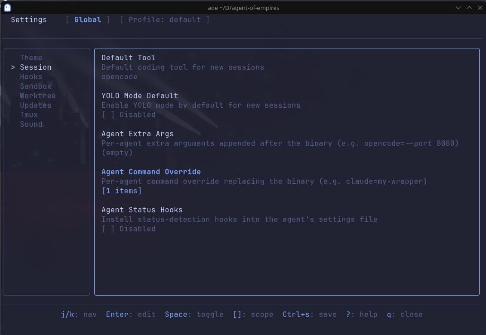

# Agent Command Overrides

The "Agent Command Override" feature lets you define alternative commands/scripts for agents supported by `aoe`. This
can be useful for running with specific options (though this can also be done using "Agent Extra Args"), via a script,
or under a sandbox such as [nono](https://github.com/always-further/nono/).

## Configuring an override

### Via the TUI

The "Agent Command Override" setting can be found under the "Session" setting group.



You can define a command override on a per-agent basis using the format:

```
<agent>=<cmd>
```

For instance, to define an override to launch OpenCode using `nono` as a sandbox:

```
opencode=nono run --profile opencode-dev --allow-cwd -- opencode
```

### Via the config

Similarly, agent command overrides can also be added to your `aoe` config at the global, profile, or repo level:

```toml
[session.agent_command_override]
opencode = "my-opencode-command"
```

### Via the CLI

Finally, an agent command override can also be used via the CLI using the `aoe add` command:

```
aoe add --cmd-override <CMD_OVERRIDE>
```

## Priority order

As mentioned in the [Configuration Guide](configuration.md), `aoe` uses a layered configuration system. As such,
settings such as agent-command override are evaluated in the following priority order:

1. Per-session - passed via `aoe add --cmd-override` in the CLI
2. Repo override - configured in the repo project-root config
3. Profile override - configured in the profile config
4. Global override - configured in the global config

## Shell support

When running an agent command override, `aoe` attempts to use the user's `$SHELL`. However, it will default to `bash`
if:

- `$SHELL` is not set, or
- The shell is non-POSIX (`fish`, `nu`, `nushell`, `pwsh`, `powershell`)

If running a non-POSIX shell where you have defined your wrapper/command as a script, abbreviation, alias, etc, it is
advisable to either write a bash script for your override, or define it directly in `aoe`.
