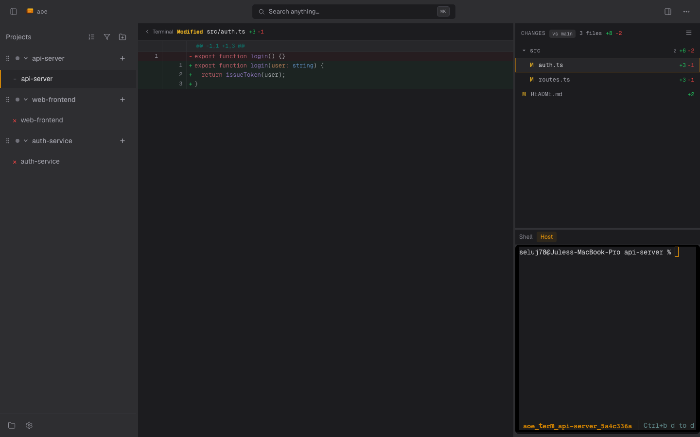

# Diff View

The diff view shows what a session changed: a list of touched files and
a syntax-highlighted, reviewable diff for each. It is the browser
counterpart to the TUI [Diff View](../diff-view.md); this page covers
the web-specific surface. Open it from the right-panel picker (mobile)
or the session split (desktop).

## Changed-files list

The file list has two layouts, toggled in its header:

- **Flat** lists every changed path.
- **Tree** nests files under collapsible directories, with a file count
  and aggregate `+`/`-` line stats per directory.

Each entry carries a color-coded status letter: `A` added, `M`
modified, `D` deleted, `R` renamed, `C` copied, `?` untracked, `U`
unmerged. Renamed files show `old → new`. Per-repo collapse state for
multi-repo workspaces is persisted to your web settings, so a directory
you fold stays folded across reloads.

Keyboard navigation: arrow up / down moves the selection, arrow
left / right expands or collapses a directory in tree view, and
Enter / Space opens a file or toggles a directory.

## Base override

By default the diff is computed against the session's base branch. The
**base picker** chip lets you override it per session: type to filter
branches, pick one, and the diff recomputes against the new base. A
reset affordance appears while an override is active. The override is
sent to the server (`PATCH /api/sessions/{id}/diff-base`) so it persists
for the session rather than living only in the browser.

## Inline review comments

The diff viewer supports drafting review comments anchored to specific
lines:

- A `+` button in the gutter starts a range selection. Click a line to
  latch the start, click again to set the end, and a draft comment form
  opens at the end of the range.
- Clicking across a different hunk or the other side of the diff
  restarts the selection rather than spanning an unrelated range.
- Drafted comments collect into a review you publish with the **Send
  comments** action. A stale-comments section flags comments whose
  anchored lines have since moved, in a warning color.

Binary files and files too large to render inline are shown with a
header and stats but no hunk body.
