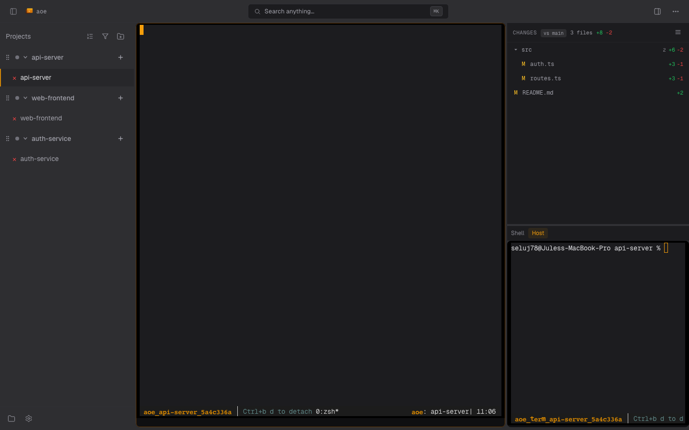

# Terminal View

For tmux-backed sessions the dashboard renders a real terminal in the
page: the agent's pane streamed over a WebSocket PTY relay, plus an
optional paired shell. This page covers both terminals, how reconnect
behaves, and the close codes you may see when a connection fails. For
the structured cockpit rendering used by ACP sessions, see the
[Cockpit overview](../../cockpit.md).

## Agent terminal

The main terminal attaches to the session's tmux pane through an
xterm.js front end. It is a full terminal: every key sequence, color,
and scrollback line behaves the same as `tmux attach` over SSH. The
server spawns `tmux attach-session` inside a PTY and relays the raw
byte stream bidirectionally over the WebSocket.

Scrolling up into history pauses the live tail and surfaces a **Back to
live** button; scrolling back to the bottom (or clicking it) resumes the
tail.

## Terminal copy and scroll

The live terminal uses tmux for scrollback and selection, so copy and scroll
work together with no modifier keys:

- **Scroll** with the mouse wheel (or a two-finger swipe on touch) to move back
  through tmux scrollback. A "Back to live" control returns you to the bottom.
- **Select** by click-dragging across the text. Dragging upward past the top
  edge scrolls into the scrollback and extends the selection, so you can grab
  output taller than the window. Releasing the drag copies the selection to
  your system clipboard automatically; no Ctrl/Cmd+C needed.

Copy-to-clipboard relies on the browser Clipboard API, which is only available
in a secure context: pages served over HTTPS (the remote-access tunnel modes)
or over `http://localhost`. On a plain-HTTP LAN/VPN origin the browser blocks
clipboard writes, and the selection stays visible but is not copied. Firefox
is best-effort here because it does not support the asynchronous clipboard
write the terminal uses; Chromium and Safari copy reliably.

## Paired terminal

Alongside the agent pane, each session can open a **paired terminal**: a
host (or, for sandboxed sessions, in-container) shell rooted at the
session's working directory. On desktop it shares the split with the
agent terminal; on mobile it is one of the right-panel picker's views.
The paired shell stays alive in the background when you switch away, so
its scrollback and focus survive view switches.

## Reconnect

If the WebSocket drops (network blip, tunnel re-auth, daemon restart),
the terminal reconnects on a fast-start retry ladder (200ms, 400ms,
800ms, 1.5s, 3s, 6s, 10s) so transient warm-up failures recover in well
under five seconds. A disconnect banner shows the current state; a
permanently dead pane surfaces a manual retry button instead of looping.

### Terminal WebSocket close codes

When the browser fails to reach a working terminal, the disconnect banner shows the close code returned by the server. Decoder ring:

| Code | Reason string             | Meaning                                                                                                                                              | Client behavior              |
| ---- | ------------------------- | ---------------------------------------------------------------------------------------------------------------------------------------------------- | ---------------------------- |
| 1001 | `server shutdown`         | Daemon is shutting down (SIGINT/SIGTERM).                                                                                                            | Retry with normal backoff.   |
| 1011 | `openpty_failed`          | Server could not allocate a PTY.                                                                                                                     | Retry with normal backoff.   |
| 1011 | `attach_spawn_failed`     | Server could not spawn the `tmux attach-session` child process.                                                                                      | Retry with normal backoff.   |
| 1011 | `pty_reader_failed`       | Server could not clone the PTY reader handle.                                                                                                        | Retry with normal backoff.   |
| 1011 | `pty_writer_failed`       | Server could not take the PTY writer handle.                                                                                                         | Retry with normal backoff.   |
| 1013 | `tmux_not_ready`          | Server polled `tmux has-session` / `list-panes` for up to 2s and the pane did not become attachable. Usually a benign warm-up on first session open. | Retry with normal backoff.   |
| 4001 | `pty_dead`                | PTY relay was running but the pane permanently exited. Continuing to retry would just hammer a dead session.                                         | Show "Click retry" banner.   |

The browser uses the fast-start retry ladder above so transient warm-up failures recover quickly. Permanently dead panes short-circuit on 4001 and surface a manual reconnect button.

## Read-only mode

When the server runs with `aoe serve --read-only`, the terminal renders
the live stream but drops keystrokes: you can watch sessions but cannot
type into them. The session-row Delete and triage actions are hidden in
this mode as well.

## On mobile

The terminal owns the full viewport on phones. A floating keyboard
button toggles the soft keyboard, and a terminal toolbar exposes a
`Ctrl` modifier toggle for shortcuts that need it. The terminal is kept
mounted (hidden, not unmounted) while you switch panes so xterm.js keeps
its geometry, scrollback, and focus.
